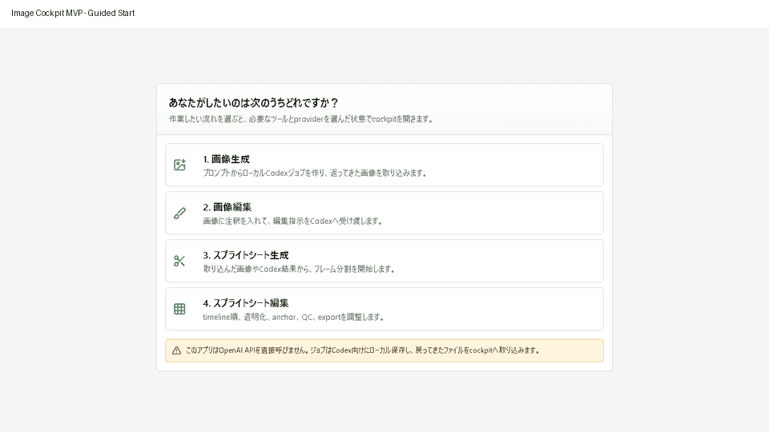

# Image Cockpit for Codex Workflows

Local image production cockpit for Codex-era workflows.

This project is unofficial and not affiliated with OpenAI. It is a local workspace for generating pixel art, then turning selected pixel-art assets into animation frames and sprite sheets.



## Product Boundary

Image Cockpit is designed to run on a local machine where Codex is installed. The app itself does not call OpenAI APIs and does not require an API key.

For the fastest local loop, the app also includes a built-in procedural PNG generator. It is local and deterministic, meant to make pixel art generation and pixel-art-to-animation generation runnable end-to-end without external services. It is not a replacement for a dedicated AI image model.

Instead, the cockpit writes local handoff jobs for Codex:

```text
codex-handoff/
  inbox/   # JSON jobs created by Image Cockpit
  assets/  # selected source images copied for a job
  outbox/  # images or metadata returned by Codex/user workflows
```

Codex, the user, or another local workflow can read the inbox job, create or revise assets, and place results in the outbox. Results can then be imported through the Local Inbox / Import flow.

When `IMAGE_COCKPIT_CODEX_AUTORUN=1`, the local handoff server will try to start `codex exec` after writing a job. The app still does not call OpenAI APIs directly; it only launches the locally installed Codex command. On Windows, the server prefers a terminal-runnable Codex CLI discovered under `%LOCALAPPDATA%\OpenAI\Codex\bin\...` over the WindowsApps desktop shim when `IMAGE_COCKPIT_CODEX_COMMAND=codex`. If no runnable Codex command is available, the job remains in `codex-handoff/inbox/` for manual pickup and the UI unlocks instead of waiting forever.

The local API also exposes `GET /api/codex/runner` so the UI can show whether the configured Codex command is ready, disabled for manual handoff, or unavailable before a job is created.

The local generation endpoint is `POST /api/generate`. It writes generated PNGs to `codex-handoff/outbox/` and returns data URLs so the browser can add them to the history immediately.

Manual handoff steps are documented in `docs/usage/manual-handoff.md`.

## MVP Flow

- Choose one of two starting workflows: pixel art generation, or animation generation.
- Generate a local pixel-art PNG from a prompt.
- Upload or select a pixel-art source before generating animation.
- Generate animation frames from that pixel-art source; a sprite sheet is produced as part of the process.
- Select history items and review them on the canvas.
- Reorder frames in the timeline and review action metadata.
- Run lightweight QC checks for size consistency, transparency, duplicates, and anchor placement.
- Export a PNG sprite sheet, frame ZIP, GIF, and sprite metadata JSON.

## Setup

```powershell
npm install
npm run dev:all
```

`npm run dev:all` starts both the local handoff API and the Vite app. If the default Vite port is busy, Vite will print the actual local URL.

You can still run the two processes separately:

```powershell
npm run dev:server
npm run dev
```

Optional handoff location:

```powershell
Copy-Item .env.example .env
# Set IMAGE_COCKPIT_HANDOFF_DIR to a local folder if you want jobs written elsewhere.
# Set IMAGE_COCKPIT_CODEX_COMMAND if Codex is installed under a custom executable path.
npm run dev:server
```

Codex autorun settings:

```text
IMAGE_COCKPIT_CODEX_AUTORUN=1       # 0 disables autorun and keeps manual handoff only
IMAGE_COCKPIT_CODEX_COMMAND=codex   # executable used for `codex exec`
IMAGE_COCKPIT_CODEX_SANDBOX=workspace-write
IMAGE_COCKPIT_CODEX_APPROVAL=never
IMAGE_COCKPIT_CODEX_HELP_ARGS_JSON= # optional JSON array for wrapper preflight args
IMAGE_COCKPIT_CODEX_EXEC_ARGS_JSON= # optional JSON array for wrapper exec args
```

The default runner command is equivalent to `codex exec -c approval_policy="<approval>" --sandbox <sandbox> -`. Advanced wrapper setups can set the two JSON arg arrays when the executable needs extra fixed arguments before the Image Cockpit prompt is piped on stdin.

Runner status and logs are written locally:

```text
codex-handoff/
  status/  # runner state per job
  logs/    # stdout/stderr from codex exec
```

Runner preflight can be checked directly:

```powershell
Invoke-RestMethod http://127.0.0.1:8787/api/codex/runner
```

For a local setup diagnosis without starting the UI:

```powershell
npm run doctor
```

`npm run doctor` verifies required files, handoff folder writability, and Codex command availability. It reports the requested `command`, the actual `launchCommand`, and resolved command paths. If Codex cannot be launched but local handoff is usable, it reports a warning instead of failing.

## Verification

One-command local review:

```powershell
npm run verify
```

This runs the same required checks as the release path:

```powershell
npm run doctor
npm run typecheck
npm test
npm run build
npm run smoke
npm run release:audit
```

GitHub Actions runs the same verification path through `.github/workflows/ci.yml`.

`npm run smoke` covers local image generation, local sprite sheet generation, manual handoff mode, and a mock autorun runner that reaches `ready`, creates a job, records `completed`, writes a PNG to the outbox, and imports that PNG through the Local Inbox endpoint. This proves the local workflow and runner lifecycle wiring without claiming that the installed Codex executable completed successfully on every machine.

Optional local browser review smoke:

```powershell
npm run ui:smoke
```

`npm run ui:smoke` starts the local API and Vite app with a temporary handoff folder, opens a headless Chrome/Edge session, verifies the two-workflow start screen, clicks through pixel art generation and animation generation, and checks that both actions produce results.

Optional real Codex runner smoke:

```powershell
npm run codex:smoke
```

`npm run codex:smoke` starts the local API with a temporary handoff folder and asks the installed Codex CLI to complete a no-image handoff job by writing a Markdown sidecar into outbox. It is intentionally not part of CI because it requires a runnable local Codex installation.

Owner-review local sweep:

```powershell
npm run review:local
```

`npm run review:local` runs `npm run verify`, `npm run ui:smoke`, and `npm run codex:smoke` in sequence. Use it on the Codex-installed review machine before approving the private MVP direction.

## Review

Use `docs/review/mvp-review-report.md` for the private MVP review path, QA evidence, and known constraints.

## Release Candidate

- Changelog: `CHANGELOG.md`
- Release notes draft: `docs/release/v0.1.0-release-notes.md`
- Owner review guide: `docs/release/v0.1.0-owner-review.md`
- Final audit: `docs/release/v0.1.0-final-audit.md`
- Acceptance evidence: `docs/release/v0.1.0-acceptance-evidence.md`
- Owner decision record: `docs/release/v0.1.0-owner-decision.md`
- Release checklist: `docs/release/v0.1.0-checklist.md`
- Release runbook: `docs/release/v0.1.0-runbook.md`
- Manual handoff guide: `docs/usage/manual-handoff.md`
- CI workflow: `.github/workflows/ci.yml`
- License: `LICENSE`
- Contribution guide: `CONTRIBUTING.md`
- Security policy: `SECURITY.md`
- Code of conduct: `CODE_OF_CONDUCT.md`

## Roadmap

See `docs/roadmap/release-roadmap.md` for the path from the current private MVP to the first public release.

## Assets And Data

- No API key is required by this app.
- No direct OpenAI API requests are made by this app.
- Optional adapters for local tools can be added later.
- Generated outputs are user-controlled and imported/exported from the browser.
- Sample assets are original generated demo assets for this repository.
- No model weights are included.
- No API keys, tokens, or license-unclear sample assets should be committed.

## Demo

The current MVP demo GIF is `docs/demo/mvp-demo.gif`. See `docs/demo/mvp-demo-capture.md` for the capture plan. Current QA screenshots live under `docs/qa/`.
